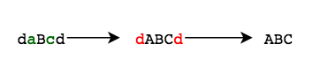

# Abbreviation

You can perform the following operations on the string, $a$:

1. Capitalize zero or more of $a$'s lowercase letters.
2. Delete all of the remaining lowercase letters in $a$.

Given two strings, $a$ and $b$, determine if it's possible to make $a$ equal to $b$ as described. If so, print YES on a new line. Otherwise, print NO.

For example, given $a = AbcDE$ and $b = ABDE$, in $a$ we can convert $b$ and delete $c$ to match $b$. If $a = AbcDE$ and $b = AFDE$, matching is not possible because letters may only be capitalized or discarded, not changed.

## Function Description

Complete the function $abbreviation$ in the editor below. It must return either $YES$ or $NO$.

abbreviation has the following parameter(s):

* a: the string to modify
* b: the string to match

## Input Format

The first line contains a single integer $q$, the number of queries.

Each of the next $q$ pairs of lines is as follows:\
\- The first line of each query contains a single string, $a$.\
\- The second line of each query contains a single string, $b$.

## Constraints

* $1 ≤ q ≤ 10$
* $1 ≤ |a|, |b| ≤ 1000$
* String $a$ consists only of uppercase and lowercase English letters, ascii[A-Za-z].
* String $b$ consists only of uppercase English letters, ascii[A-Z].

## Output Format

For each query, print YES on a new line if it's possible to make string $a$ equal to string $b$. Otherwise, print NO.

## Sample Input

```text
1
daBcd
ABC
```

## Sample Output

```text
YES
```

## Explanation



We have $a =$ daBcd and $b =$ ABC. We perform the following operation:

1. Capitalize the letters a and c in $a$ so that $a =$ dABCd.
2. Delete all the remaining lowercase letters in $a$ so that $a =$ ABC.

Because we were able to successfully convert $a$ to $b$, we print YES on a new line.

## Solution

Let's call the first string of test case as $A$ and the second string of test case as $B$. Let $dp[i, j]$ = 1, if there is a way to transform the first $i$ characters of $A$ into the first $j$ characters of $B$, else $dp[i, j]$ = 0. Consider that after a few operations we have reached the state $dp[i, j]$ and it is equal to 1. Now there are only three different conditions to consider:

* If there is an uppercase letter at position $i + 1$ in $A$ and we have already considered $j$ characters in $B$, then in case where the $(i + 1)^{th}$ character of $A$ is equal to the $(j + 1)^{th}$ character of $B$, the $(i + 1)^{th}$ character will be placed at $(j + 1)^{th}$ position in $B$. The state $dp[i + 1, j + 1]$ becomes achievable, i.e; it is equal to 1.
* If there is a lowercase letter at position $i + 1$ in $A$, then it cannot be used in $B$ because $B$ only has uppercase letters. $dp[i + 1, j]$ becomes achievable, which means that $j$ characters of $B$ can be formed using the first $i + 1$ characters of .
* If there is a lowercase letter at position $i + 1$ in $A$, then it can be placed at position $j + 1$ in $B$ if $(j + 1)^{th}$ character is an uppercase equivalent of $i + 1$ character in $A$. $dp[i + 1, j + 1]$ becomes achievable.

So, after searching all the states, achievable states will be marked as 1. The answer is YES, if for the last character of $A$ there exists a way to transform it to the last character of $B$.