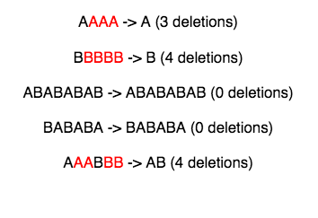

# Alternating Characters

You are given a string containing characters $A$ and $B$ only. Your task is to change it into a string such that there are no matching adjacent characters. To do this, you are allowed to delete zero or more characters in the string.

Your task is to find the minimum number of required deletions.

For example, given the string $s = AABAAB$, remove an $A$ at positions $0$ and $3$ to make $s = ABAB$ in $2$ deletions.

**Function Description**

Complete the alternatingCharacters function in the editor below. It must return an integer representing the minimum number of deletions to make the alternating string.

alternatingCharacters has the following parameter(s):

- s: a string

**Input Format**

The first line contains an integer $q$, the number of queries.\
The next $q$ lines each contain a string $s$.

**Constraints**

- $1 \leq q \leq 10$
- $1 \leq |s| \leq 10^5$
- Each string $s$ will consist only of characters $A$ and $B$

**Output Format**

For each query, print the minimum number of deletions required on a new line.

**Sample Input**

```
5
AAAA
BBBBB
ABABABAB
BABABA
AAABBB
```

**Sample Output**

```
3
4
0
0
4
```

**Explanation**

The characters marked red are the ones that can be deleted so that the string doesn't have matching consecutive characters.



# 문자 교체

문자 $A$와 $B$만 포함 된 문자열이 제공됩니다. 귀하의 작업은 일치하는 인접 문자가 없는 문자열로 변경하는 것입니다. 이렇게 하려면 문자열에서 0개 이상의 문자를 삭제할 수 있습니다.

귀하의 작업은 필요한 최소 삭제 횟수를 찾는 것입니다.

예를 들어, 문자열 s = AABAAB이 주어지면, 위치 0과 3에서 A를 제거하여 2개의 삭제에서 s = ABAB로 만듭니다.

**함수 설명**

아래 편집기에서 alternatingCharacters 함수를 완성하십시오. 교체 문자열을 만들기 위해 최소 h 제 수를 나타내는 정수를 돌려보내야 합니다.

alternatingCharacters에는 다음과 같은 매개 변수가 있습니다.

- s: 문자열

**입력 형식**

첫 번째 줄에는 질의 수인 정수 $q$가 포함됩니다.\
다음 $q$ 줄은 각각 문자열 $s$를 포함합니다.

**제약 조건**

- $1 \leq q \leq 10$
- $1 \leq |s| \leq 10^5$
- 각 문자열 $s$는 문자 $A$와 $B$로만 구성됩니다.

**출력 형식**

각 질의에 대해 새 줄에 필요한 최소 삭제 수를 인쇄하십시오.

**샘플 입력**

```
5
AAAA
BBBBB
ABABABAB
BABABA
AAABBB
```

**샘플 출력**

```
3
4
0
0
4
```

**설명**

빨간색으로 표시된 문자는 문자열이 일치하는 연속 문자를 갖지 않도록 삭제할 수 있는 문자입니다.


# 해결법

s[1]부터 s[s.size()]까지 순회하며 현재 원소가 이전 원소와 같다면 카운트를 추가한다.